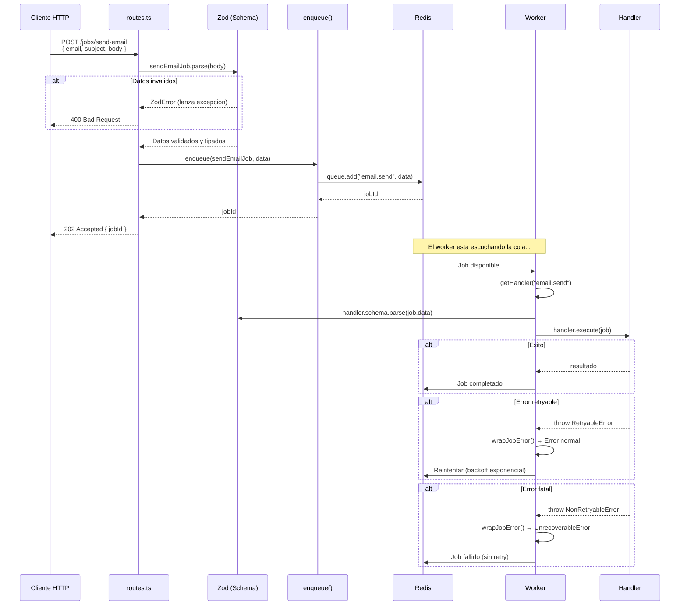
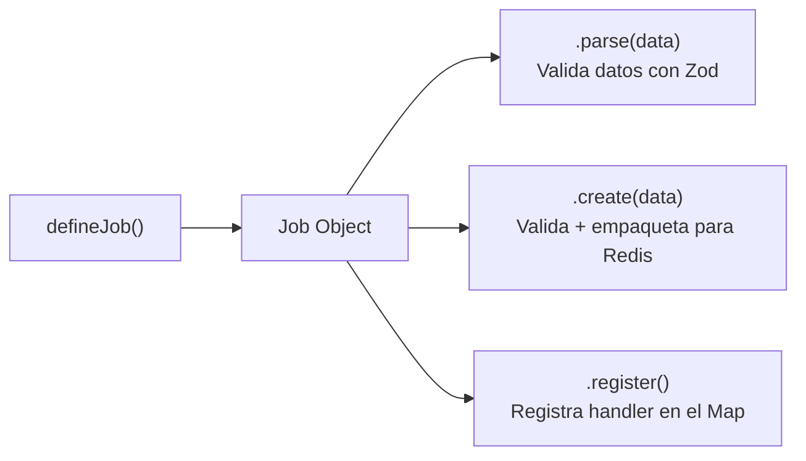
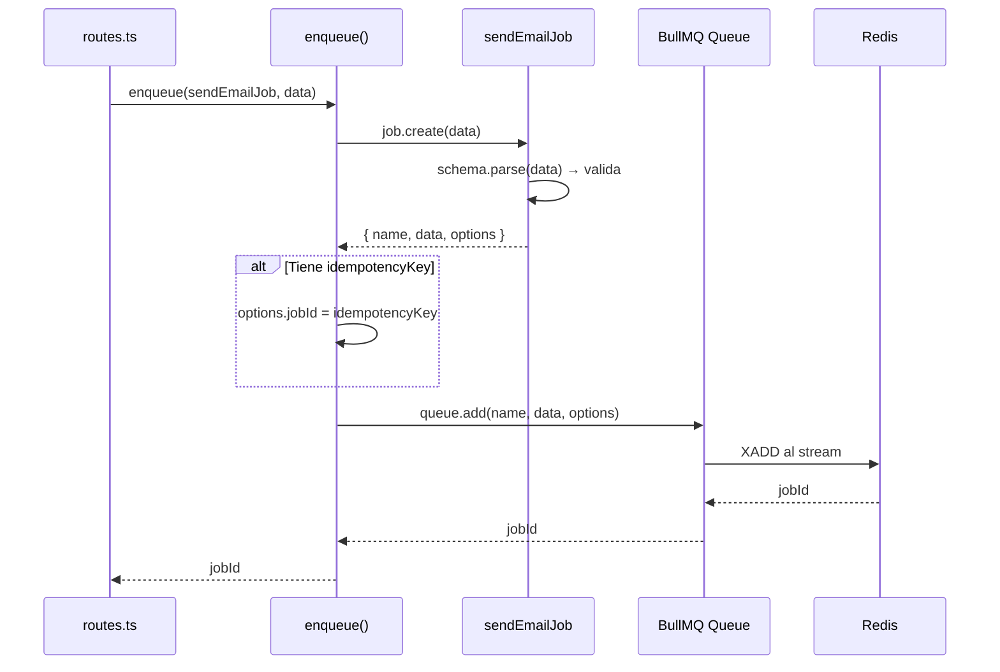
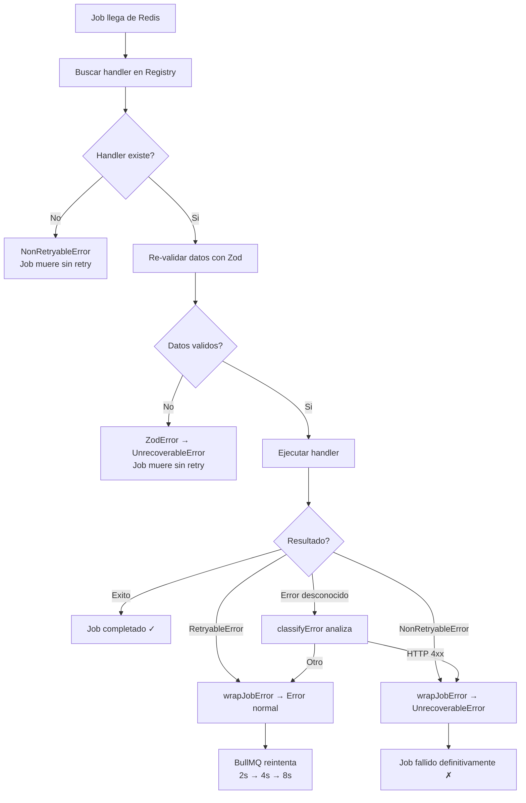
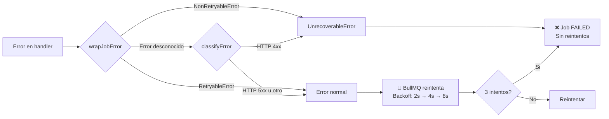
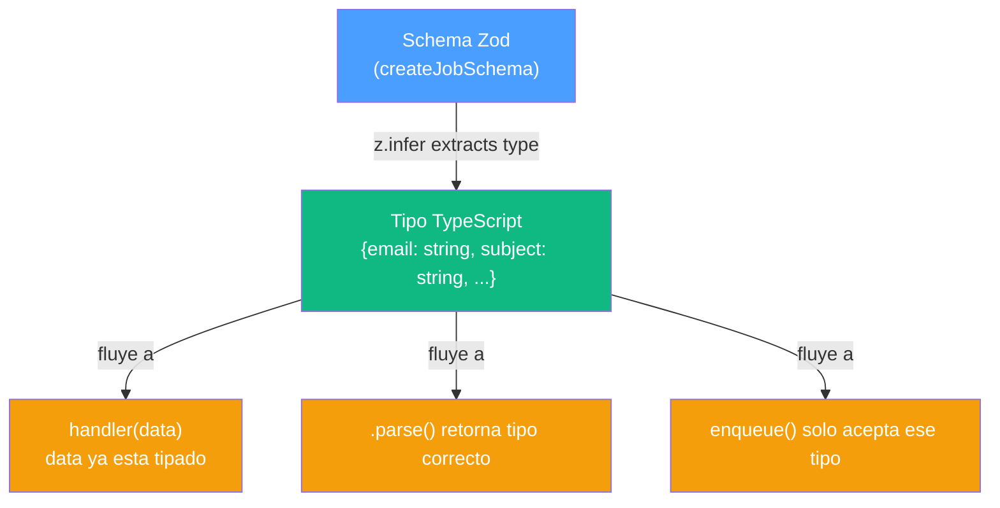

# Guia de Arquitectura: Sistema Declarativo de Colas

## La Analogia del Restaurante

Imagina un restaurante para entender todo el sistema:

| Restaurante | Nuestro Sistema | Archivo |
|---|---|---|
| El restaurante abre | `startServer()` | `src/index.ts` |
| Registran a los chefs | `registerJobs([...])` | `src/queue/job.ts` |
| Abren las cocinas | `createWorker(queue)` | `src/queue/create-worker.ts` |
| El mesero recibe un pedido | Ruta POST recibe request | `src/api/routes.ts` |
| Revisan que la comanda este bien escrita | `sendEmailJob.parse(data)` | Zod valida |
| Meten la comanda en la cocina | `enqueue(sendEmailJob, data)` | `src/queue/client.ts` |
| El chef toma la comanda | Worker toma job de Redis | BullMQ Worker |
| El chef cocina | `handler(data, job)` | `src/queue/jobs/*.ts` |
| Si sale mal, reintentan | BullMQ retry con backoff | `src/queue/errors.ts` |

---

## El Flujo Completo Paso a Paso

### Diagrama de Secuencia



---

## Detalle de Cada Pieza

### 1. defineQueue() — Configurar una cocina

**Archivo:** `src/queue/define-queue.ts`

Un queue es simplemente un nombre + configuracion por defecto. No crea nada en Redis todavia, solo describe como se va a comportar.

```typescript
export const emailQueue = defineQueue({
  name: 'email',   // nombre unico de la cola
});
```

Lo que retorna es un objeto inmutable (no se puede modificar despues):

```typescript
{
  name: 'email',
  defaultJobOptions: {
    attempts: 3,                                    // 3 intentos maximo
    backoff: { type: 'exponential', delay: 2000 },  // 2s, 4s, 8s entre reintentos
    removeOnComplete: { age: 3600, count: 1000 },   // limpiar despues de 1 hora
    removeOnFail: { age: 86400, count: 5000 },      // limpiar fallos despues de 24h
  }
}
```

**Por que es un objeto y no se crea la cola directamente?** Porque la cola real en Redis se crea solo cuando llega el primer job (lazy). Si la crearas al importar el archivo, tendrias conexiones a Redis abiertas aunque nadie mande jobs.

---

### 2. createJobSchema() — El formulario de validacion

**Archivo:** `src/queue/define-job.ts`

#### Por que Zod valida automaticamente?

Zod es una libreria que hace dos cosas al mismo tiempo:

1. **Valida datos en runtime** — si alguien manda `{ email: 123 }` en vez de `{ email: "user@test.com" }`, Zod lanza un error antes de que el dato entre a Redis
2. **Genera tipos de TypeScript** — no tienes que escribir interfaces manualmente, Zod las infiere del schema

```typescript
// Sin Zod: tienes que mantener DOS cosas sincronizadas
interface SendEmailData {    // 1. El tipo (para TypeScript)
  email: string;
  subject: string;
  body: string;
}
function validate(data: unknown): SendEmailData {  // 2. La validacion (para runtime)
  if (typeof data.email !== 'string') throw new Error('...');
  // ... mas validaciones manuales
}

// Con Zod: UNA sola definicion hace ambas cosas
const sendEmailSchema = createJobSchema({
  email: z.string().email(),     // valida Y es tipo string
  subject: z.string().min(1),    // valida Y es tipo string
  body: z.string().min(1),       // valida Y es tipo string
});

type SendEmailData = z.infer<typeof sendEmailSchema>;
// TypeScript infiere: { email: string; subject: string; body: string; idempotencyKey?: string; metadata?: {...} }
```

#### Que hace createJobSchema() internamente?

```typescript
// Esto:
const sendEmailSchema = createJobSchema({
  email: z.string().email(),
  subject: z.string().min(1),
  body: z.string().min(1),
});

// Es equivalente a esto (pero sin repetir codigo):
const sendEmailSchema = z.object({
  idempotencyKey: z.string().optional(),     // ← se agrega automaticamente
  metadata: z.object({                        // ← se agrega automaticamente
    triggeredBy: z.string().optional(),
    correlationId: z.string().optional(),
  }).optional(),
  email: z.string().email(),                  // ← tu campo
  subject: z.string().min(1),                 // ← tu campo
  body: z.string().min(1),                    // ← tu campo
});
```

`createJobSchema()` toma TUS campos y les agrega `idempotencyKey` y `metadata` automaticamente usando `baseJobSchema.extend(shape)`. Asi nunca olvidas esos campos base.

---

### 3. defineJob() — Todo en un solo lugar

**Archivo:** `src/queue/define-job.ts`

#### Por que todo esta en un solo archivo por job?

Imagina el enfoque viejo con archivos separados:

```
VIEJO (5 archivos para un job):
├── src/jobs/types.ts      ← definir el nombre "SEND_EMAIL"
├── src/jobs/schemas.ts    ← definir el schema de validacion
├── src/workers/email.ts   ← definir el handler (que hace)
├── src/queues/index.ts    ← conectar nombre + worker
└── src/api/routes.ts      ← validar + encolar
```

Si quieres cambiar algo del job de email, tienes que abrir 5 archivos y asegurarte de que todo este sincronizado. Si agregas un campo `cc` al email, tienes que actualizar el schema, el tipo, el worker, la ruta...

```
NUEVO (1 archivo por job + registrar):
├── src/queue/jobs/send-email.ts   ← schema + handler juntos
└── src/index.ts                    ← agregar al array de registerJobs
```

Veamos que contiene `send-email.ts`:

```typescript
// src/queue/jobs/send-email.ts

// 1. Schema: QUE datos necesita (el formulario)
const sendEmailSchema = createJobSchema({
  email: z.string().email(),
  subject: z.string().min(1),
  body: z.string().min(1),
});

// 2. Job completo: schema + cola + handler (todo junto)
export const sendEmailJob = defineJob({
  name: 'email.send',            // nombre unico del job
  queue: emailQueue,              // a que cola va
  schema: sendEmailSchema,        // como se valida

  async handler(data, job) {      // QUE HACE con los datos
    // data esta tipado: { email: string, subject: string, body: string, ... }
    // No necesitas castear nada, TypeScript ya sabe los tipos
    await enviarEmail(data.email, data.subject, data.body);
    return { success: true };
  },
});
```

#### Que retorna defineJob()?

Un objeto con 3 metodos utiles:



| Metodo | Donde se usa | Que hace |
|---|---|---|
| `.parse(data)` | En las rutas API | Valida datos del request y retorna datos tipados |
| `.create(data)` | Internamente en `enqueue()` | Valida + empaqueta con nombre y opciones |
| `.register()` | En `registerJobs()` al arrancar | Pone el handler en el registro central |

---

### 4. Handler Registry — El directorio de chefs

**Archivo:** `src/queue/handler.ts`

Es un `Map` (diccionario) donde la clave es el nombre del job y el valor es su handler:

```
┌─────────────────────────────────────────────┐
│           Handler Registry (Map)            │
├──────────────────┬──────────────────────────┤
│ "email.send"     │ { schema, execute() }    │
│ "data.process"   │ { schema, execute() }    │
└──────────────────┴──────────────────────────┘
```

**Como se llena?** Al arrancar, `registerJobs()` llama a `.register()` de cada job:

```typescript
// src/index.ts (al arrancar la app)
registerJobs([sendEmailJob, processDataJob]);
// Internamente: sendEmailJob.register() → Map.set("email.send", handler)
// Internamente: processDataJob.register() → Map.set("data.process", handler)
```

**Como se usa?** Cuando un worker toma un job de Redis, busca el handler por nombre:

```typescript
// Dentro de createWorker(), cuando llega un job:
const handler = getHandler(job.name);  // "email.send" → { schema, execute }
handler.schema.parse(job.data);        // re-valida los datos
await handler.execute(job);            // ejecuta el handler
```

**Por que re-valida?** Porque entre que el job entro a Redis y el worker lo toma, podria haber pasado tiempo. Los datos en Redis son JSON crudo, re-validar garantiza que siguen siendo correctos.

---

### 5. enqueue() — Meter el job en Redis

**Archivo:** `src/queue/client.ts`



El truco de la idempotencia: si mandas `idempotencyKey: "abc123"`, ese string se convierte en el `jobId` de Redis. Redis no permite dos jobs con el mismo ID, asi que automaticamente rechaza duplicados. No necesitas logica extra.

---

### 6. createWorker() — Abrir la cocina

**Archivo:** `src/queue/create-worker.ts`

Un worker es un proceso que escucha una cola de Redis esperando jobs. Cuando llega uno:



---

### 7. Sistema de Errores — Que pasa cuando algo falla?

**Archivo:** `src/queue/errors.ts`

BullMQ tiene un concepto simple: si un handler lanza un error, el job se reintenta. Si lanza un `UnrecoverableError`, el job muere sin retry.

Nosotros tenemos DOS clases de error que se convierten a eso automaticamente:

#### Tipo 1: NonRetryableError (no reintentar)

Usalo cuando sabes que reintentar no va a servir de nada:

```typescript
// Ejemplo: el email no existe, reintentar no lo va a crear
async handler(data, job) {
  const user = await db.findUser(data.userId);
  if (!user) {
    throw new NonRetryableError('Usuario no existe');
    // → wrapJobError() lo convierte a UnrecoverableError
    // → BullMQ marca el job como FAILED y NO reintenta
  }
}
```

**Cuando usar:**
- Datos invalidos que no van a cambiar
- Configuracion incorrecta
- Recursos que no existen
- Errores HTTP 4xx (bad request, not found, forbidden)

#### Tipo 2: RetryableError (reintentar con backoff)

Usalo cuando el problema puede ser temporal:

```typescript
// Ejemplo: el servidor de email esta caido, pero puede volver
async handler(data, job) {
  try {
    await emailService.send(data.email, data.subject, data.body);
  } catch (err) {
    throw new RetryableError('Servidor de email no disponible', err);
    // → wrapJobError() lo deja como Error normal
    // → BullMQ reintenta: 2s, luego 4s, luego 8s (exponencial)
    // → Si falla 3 veces, el job se marca como FAILED
  }
}
```

**Cuando usar:**
- Servicios externos caidos temporalmente
- Timeouts de red
- Rate limiting (demasiadas peticiones)
- Errores HTTP 5xx (server error)

#### Tipo 3: Errores desconocidos (clasificacion automatica)

Si lanzas un error que NO es `NonRetryableError` ni `RetryableError`, `classifyError()` decide:

```typescript
async handler(data, job) {
  const response = await fetch('https://api.example.com');
  // Si fetch lanza un error con status 404 → classifyError() → "fatal" → no retry
  // Si fetch lanza un error con status 500 → classifyError() → "retry" → reintenta
  // Si fetch lanza un error sin status       → classifyError() → "retry" → reintenta
}
```

#### Diagrama del flujo de errores



---

### 8. Por que TypeScript sabe exactamente que datos tiene cada job?

La magia esta en como Zod infiere tipos. Veamos el flujo completo:

```typescript
// PASO 1: Defines el schema con Zod
const sendEmailSchema = createJobSchema({
  email: z.string().email(),
  subject: z.string().min(1),
  body: z.string().min(1),
});
// TypeScript infiere el tipo del schema:
// z.infer<typeof sendEmailSchema> = {
//   email: string;
//   subject: string;
//   body: string;
//   idempotencyKey?: string;
//   metadata?: { triggeredBy?: string; correlationId?: string };
// }

// PASO 2: defineJob() usa el schema como generic
export const sendEmailJob = defineJob({
  name: 'email.send',
  queue: emailQueue,
  schema: sendEmailSchema,  // ← TypeScript lee el tipo del schema

  async handler(data, job) {
    // data AUTOMATICAMENTE tiene el tipo inferido del schema
    // TypeScript sabe que:
    //   data.email    → string ✓
    //   data.subject  → string ✓
    //   data.body     → string ✓
    //   data.xyz      → ERROR (no existe en el schema)
  },
});

// PASO 3: En las rutas, .parse() retorna datos tipados
const { email, subject, body } = sendEmailJob.parse(req.body);
// email: string ✓ (TypeScript lo sabe)
// subject: string ✓
// body: string ✓

// PASO 4: enqueue() solo acepta datos del tipo correcto
await enqueue(sendEmailJob, { email, subject, body });
// Si intentas: enqueue(sendEmailJob, { email, subject, xyz: 123 })
// TypeScript marca error EN TIEMPO DE DESARROLLO (ni siquiera compila)
```



**El beneficio:** si cambias el schema (por ejemplo, agregas un campo `cc`), TypeScript te muestra errores en TODOS los lugares donde falta ese campo. No puedes olvidar actualizar la ruta o el handler.

---

## Agregar un Job Nuevo: Ejemplo Paso a Paso

Quieres agregar un job que genere reportes PDF. Solo necesitas **4 pasos**:

### Paso 1: Crear el archivo del job

```typescript
// src/queue/jobs/generate-report.ts
import { z } from 'zod';
import { defineJob, createJobSchema } from '../define-job.js';
import { dataProcessingQueue } from '../queues/index.js';    // reutilizas una cola existente

const generateReportSchema = createJobSchema({
  reportType: z.enum(['sales', 'inventory', 'users']),
  startDate: z.string().min(1),
  endDate: z.string().min(1),
});

export const generateReportJob = defineJob({
  name: 'report.generate',
  queue: dataProcessingQueue,
  schema: generateReportSchema,

  async handler(data, job) {
    // data tiene: { reportType, startDate, endDate, idempotencyKey?, metadata? }
    const pdf = await crearPDF(data.reportType, data.startDate, data.endDate);
    return { url: pdf.url };
  },
});
```

### Paso 2: Registrar en el arranque

```typescript
// src/index.ts
import { generateReportJob } from './queue/jobs/generate-report.js';

registerJobs([sendEmailJob, processDataJob, generateReportJob]);  // agregar al array
```

### Paso 3: Agregar la ruta API

```typescript
// src/api/routes.ts
import { generateReportJob } from '../queue/jobs/generate-report.js';

router.post('/jobs/generate-report', asyncRoute(async (req, res) => {
  const idempotencyKey = getIdempotencyKey(req);
  const data = generateReportJob.parse({
    ...req.body as Record<string, unknown>,
    idempotencyKey,
  });

  const jobId = await enqueue(generateReportJob, data);
  res.status(202).json({ success: true, jobId, status: 'queued' });
}));
```

### Paso 4: Exportar (opcional, para tests)

```typescript
// src/queue/jobs/index.ts
export { generateReportJob } from './generate-report.js';
```

**Eso es todo.** No necesitas crear workers nuevos, no necesitas definir tipos en otro archivo, no necesitas tocar la configuracion de Redis. El sistema se encarga.
